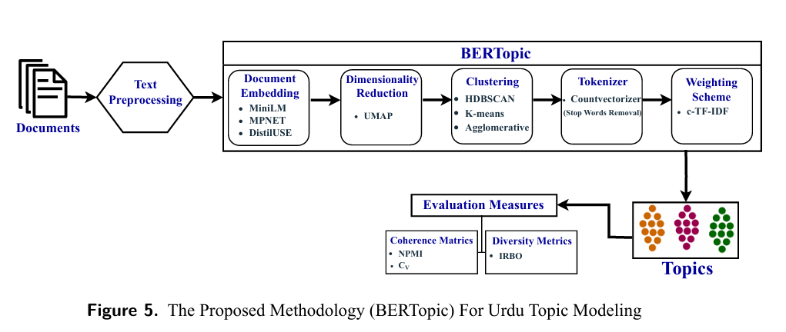

# BERTopic for Urdu News: A Benchmark Study on Classical and Neural Topic Modeling Techniques

## Overview

This repository contains the complete implementation of the research presented in the manuscript:

**"BERTopic for Urdu News: A Benchmark Study on Classical and Neural Topic Modeling Techniques."**

The project provides a comprehensive benchmarking framework for topic modeling on Urdu news articles by comparing traditional statistical topic modeling techniques with modern neural topic modeling approaches.

The repository includes:

- Data preprocessing pipeline
- BERTopic implementation
- Classical topic modeling algorithms
- Neural topic modeling algorithms
- Evaluation metrics

This repository is intended to ensure the reproducibility of all experiments.

---

# Table of Contents

- Dataset Information
- Code Information
- Usage Instruction
- Requirements
- Methodology
- Citation
- License
- Contribution
- Contact
---

# Dataset Information

This repository includes experiments conducted on two Urdu news corpora: the proposed **Urdu News Topic Modeling (UNTM)** corpus and the benchmark **Urdu Document Clustering (UDC)** corpus. These datasets were used to evaluate the performance of BERTopic and compare it with several classical and neural topic modeling approaches.

---

## 1. Urdu News Topic Modeling (UNTM) Corpus

The **Urdu News Topic Modeling (UNTM)** corpus is a large-scale Urdu news dataset developed in this study for topic modeling research. The corpus was created by scraping news articles from multiple online Urdu news websites covering seven major news categories. After data collection, duplicate and irrelevant records were removed, followed by text preprocessing to prepare the corpus for topic modeling experiments.

The final dataset consists of **7,991** Urdu news articles containing more than **2 million tokens**, making it one of the largest publicly available datasets for Urdu topic modeling. The UNTM corpus serves as the primary dataset for evaluating the proposed BERTopic framework.

## Dataset Structure

```
dataset/
├── UNTM Dataset.CSV
├── Dataset Statistics/
├── Dataset Scraping Code/
│   ├── Politics.py
│   ├── Business.py
│   ├── Sports.py
│   ├── Showbiz.py
│   ├── Weird.py
│   ├── Technology.py
│   └── Health.py
├── Text Preprocessing/
│   ├── Dataset Preprocessing.ipynb
│   ├── Clean Datasets/
│         ├── Clean_UNTM.CSV
│         ├── Clean_UDC.CSV

```

### UNTM Corpus Statistics

| Attribute | Value |
|-----------|-------:|
| Total News Articles | 7,991 |
| Number of Categories | 7 |
| Total Tokens | 2,035,870 |
| Unique Tokens | 53,840 |
| Minimum Document Length | 21 words |
| Maximum Document Length | 1,674 words |
| Average Document Length | 255 words |

---
### Text Preprocessing

Before training the topic modeling algorithms, the collected news articles were cleaned and standardized to improve data quality and ensure consistent topic extraction. All preprocessing operations were implemented using Python's **re (Regular Expression)** library along with standard text processing techniques.

The following preprocessing steps were applied:

- Remove extra whitespaces.
- Remove unwanted words (e.g., اخبار پوائنٹ, روزنامہ, etc.).
- Remove URLs (`http://` or `https://`).
- Remove email addresses.
- Remove punctuation marks (e.g., periods, commas, quotation marks, brackets, etc.).
- Remove digits and numerical characters.
- Remove English alphabets (`A–Z`, `a–z`) to retain only Urdu text.

After preprocessing, another coulmn is created in dataset by name (Clean_UNTM or Clean_UDC) that used as input for the BERTopic framework and other topic modeling algorithms.

## 2. Urdu Document Clustering (UDC) Corpus

The **Urdu Document Clustering (UDC)** corpus is a publicly available benchmark dataset introduced by Mustafa et al. (2020). The dataset contains Urdu news articles collected from five different categories.

To ensure a fair comparison with previous studies, the UDC corpus was used as the benchmark dataset in this research.

### UDC Corpus Statistics

| Attribute | Value |
|-----------|-------:|
| Total News Articles | 1,008 |
| Number of Categories | 5 |
| Total Tokens | 362,337 |
| Unique Tokens | 22,138 |
| Minimum Document Length | 10 words |
| Maximum Document Length | 5,510 words |
| Average Document Length | 359 words |

---

## Implemented Models
This repository contains the complete implementation of the proposed BERTopic framework along with six baseline topic modeling approaches used for comparative evaluation. The implementation includes preprocessing scripts, feature selection, hyperparameter tuning, model training, and evaluation notebooks for both the UNTM and UDC datasets.

| Model | Description |
|--------|-------------|
| **BERTopic** | Proposed transformer-based topic modeling approach |
| **LDA (GS)** | Latent Dirichlet Allocation using Gibbs Sampling |
| **LDA (VI)** | Latent Dirichlet Allocation using Variational Inference |
| **Seeded-LDA** | Seed-guided Latent Dirichlet Allocation |
| **NMF** | Non-negative Matrix Factorization |
| **NeuralLDA** | Neural Latent Dirichlet Allocation |
| **CTM** | Combined Topic Model |

---

# Repository Structure

```text
Urdu-News-Topic-Modeling/
│
├── Dataset/
│   ├── Text-Preprocessing/
│   │   ├── Clean_UNTM.csv
│   │   └── Clean_UDC.csv
│
├── Code/
│   ├── Classical Models/
│   │   ├── LDA/
│   │   │   ├── LDA(GS).ipynb
│   │   │   └── LDA(VI).ipynb
│   │   │
│   │   ├── Seeded-LDA/
│   │   │   ├── Feature_Selection.ipynb
│   │   │   ├── Final_Seed_Words.ipynb
│   │   │   └── Seeded-LDA.ipynb
│   │   │
│   │   └── NMF/
│   │       └── NMF.ipynb
│   │
│   ├── Neural Models/
│   │   ├── BERTopic/
│   │   │   ├── Final_BERTopic_UNTM.ipynb
│   │   │   ├── Final_BERTopic_UDC.ipynb
│   │   │   ├── Hyperparameter_Tuning_UNTM.ipynb
│   │   │   └── Hyperparameter_Tuning_UDC.ipynb
│   │   │
│   │   ├── NeuralLDA/
│   │   │   ├── Optimized_NeuralLDA.ipynb
│   │   │   └── Hyperparameter_Tuning.ipynb
│   │   │
│   │   ├── CTM/
│   │   │   └── Combined_Topic_Model.ipynb
│   │   │
│   │   └── ChatGPT_vs_BERTopic/
│   │       ├── BERTopic_Sample_UNTM.ipynb
│   │       ├── BERTopic_Sample_UDC.ipynb
│   │       ├── Sample_UNTM.csv
│   │       └── Sample_UDC.csv
│   │
│   └── stopwords.txt
│
├── requirements.txt
├── README.md
└── LICENSE
```

---

# Usage Instructions

Follow the steps below to reproduce the experimental results reported in the paper.

## Step 1: Clone the Repository

```bash
git clone https://github.com/shaistaDev7/Urdu-News-Topic-Modeling.git
```

## Step 2: Navigate to the Project Directory

```bash
cd Urdu-News-Topic-Modeling
```

## Step 3: Install Required Libraries

```bash
pip install -r requirements.txt
```

## Step 4: Prepare the Dataset

Place the cleaned datasets in the following directory:

```text
Dataset/
└── Text-Preprocessing/
    ├── Clean_UNTM.csv
    └── Clean_UDC.csv
```

## Step 5: Open Google Colab or Jupyter Notebook

Open the notebook corresponding to the model you want to reproduce.

For example:

| Model | Notebook |
|--------|----------|
| BERTopic (UNTM) | `Code/Neural Models/BERTopic/Final_BERTopic_UNTM.ipynb` |
| BERTopic (UDC) | `Code/Neural Models/BERTopic/Final_BERTopic_UDC.ipynb` |
| LDA (GS) | `Code/Classical Models/LDA/LDA(GS).ipynb` |
| LDA (VI) | `Code/Classical Models/LDA/LDA(VI).ipynb` |
| Seeded-LDA | `Code/Classical Models/Seeded-LDA/Seeded-LDA.ipynb` |
| NMF | `Code/Classical Models/NMF/NMF.ipynb` |
| NeuralLDA | `Code/Neural Models/NeuralLDA/Optimized_NeuralLDA.ipynb` |
| CTM | `Code/Neural Models/CTM/Combined_Topic_Model.ipynb` |

## Step 6: Execute the Notebook

Run all notebook cells sequentially to reproduce the experimental results.

For experiments, it is recommended to use **Google Colab with a T4 GPU** for faster execution.

---

# Requirements

Python 3.10 or higher

Major libraries

- bertopic
- sentence-transformers
- umap-learn
- hdbscan
- gensim
- scikit-learn
- pandas
- numpy
- matplotlib
- seaborn
- plotly
- nltk
- scipy
- octis

---
# Methodology

The proposed framework applies **BERTopic** to perform topic modeling on Urdu news articles. The workflow consists of five main stages:

1. **Text Preprocessing**
   - Clean the raw news articles by removing unwanted words, URLs, email addresses, punctuation, digits, English characters, and extra whitespaces.

2. **Document Embedding**
   - Convert each preprocessed document into a dense semantic vector using pre-trained multilingual sentence embedding models:
     - MiniLM
     - MPNET
     - DistilUSE

3. **Topic Modeling**
   - Reduce the embedding dimensionality using **UMAP**.
   - Cluster similar document embeddings using one of the following clustering algorithms:
     - HDBSCAN
     - K-Means
     - Agglomerative Clustering
   - Generate topic representations using **CountVectorizer** with Urdu stopword removal.
   - Rank topic words using the **class-based TF-IDF (c-TF-IDF)** weighting scheme.

4. **Topic Extraction**
   - Extract representative keywords for each discovered topic.

5. **Evaluation**
   - Evaluate the generated topics using:
     - **Coherence Metrics:** NPMI and C<sub>V</sub>
     - **Topic Diversity Metric:** IRBO

---
# Methodology Workflow

<p align="center">
  
</p>

# Citation

If you use this repository, code, or the UNTM dataset in your research, please cite the following work:

## Proposed Paper

```bibtex
@article{zulfiqar2026bertopic,
  title={BERTopic for Urdu News: A Benchmark Study on Classical and Neural Topic Modeling Techniques},
  author={Zulfiqar, Shaista and Muhammad Wasim and Farah Adeeba},
  journal={PeerJ Computer Science},
  year={2026},
  note={Under Review}
}
```

## Benchmark Dataset (UDC)

```bibtex
@article{mustafa2020urdu,
  title={Urdu Documents Clustering with Unsupervised and Semi-supervised Probabilistic Topic Modeling},
  author={Mustafa, Mubashar and others},
  journal={Information},
  volume={11},
  number={11},
  pages={518},
  year={2020},
  publisher={MDPI}
}
```
# License

This project is released under the **MIT License**.

You are free to use, modify, and distribute this code for academic and research purposes, provided that the original copyright notice and license are retained.

See the **LICENSE** file for complete details.

---

# Contribution

Contributions are welcome.

If you find a bug or would like to improve the repository:

1. Fork the repository.
2. Create a new branch.
3. Commit your changes.
4. Submit a Pull Request.

Please include a clear description of your proposed modifications.

---

# Contact

**Shaista Zulfiqar**

Email: shaistazulfiqar65@gmail.com

GitHub:
https://github.com/shaistaDev7

---
